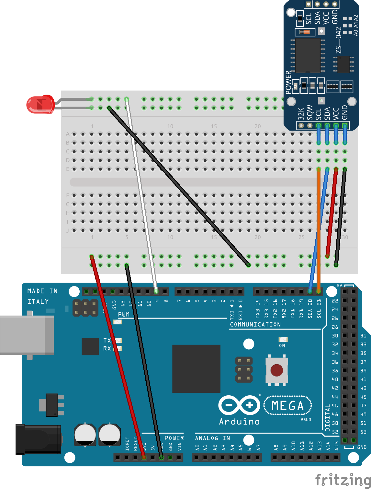

# ClockStart

This is an Arduino project to automatically start our classroom clock/timer at 7:50 AM and 11:50 AM, and to reset it to the default clock mode at 2:20 PM.

## BOM

- 1 Infrared LED
- 1 DS3231 RTC Module
- 1 Arduino Mega 2560

## Connections

See [Fritzing Schematic](./Schematics/Schematic.fzz) for more info.
